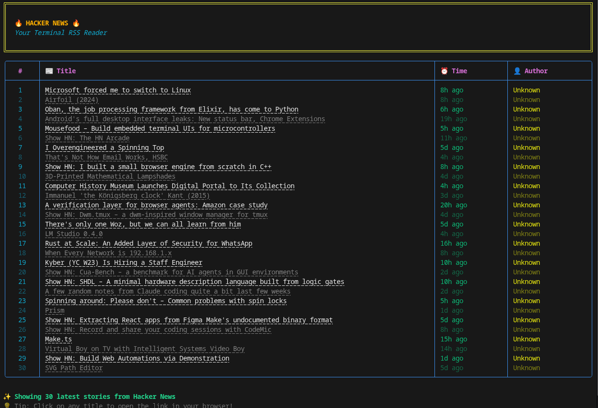

# Hacker News Terminal RSS Reader

A beautiful, interactive command-line RSS reader for Hacker News

## ✨ Features

- 📰 Fetches the latest stories from Hacker News RSS feed
- 🎨 Beautiful, colorful terminal UI using Rich library
- 📖 Interactive mode to view story details

### Interactive Commands

Once the app is running, you can:

- **Type a number (1-30)**: View detailed information about that story
- **Type 'r'**: Refresh the feed to get the latest stories
- **Type 'q'**: Quit the application

## 📝 License

MIT License - Feel free to use and modify!